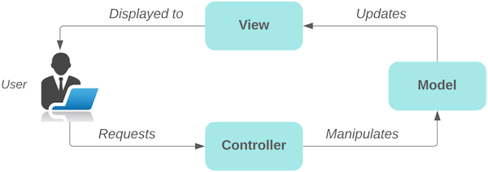
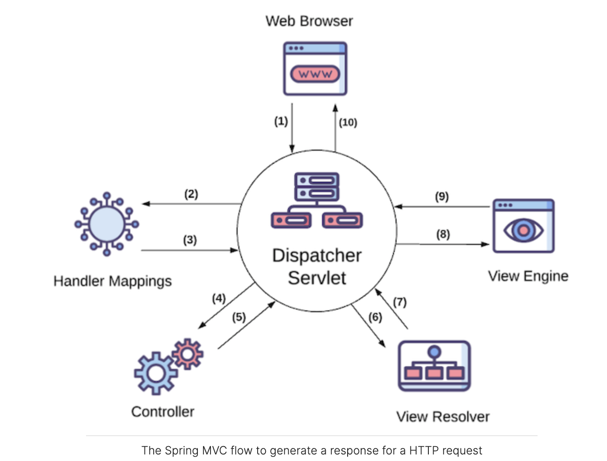
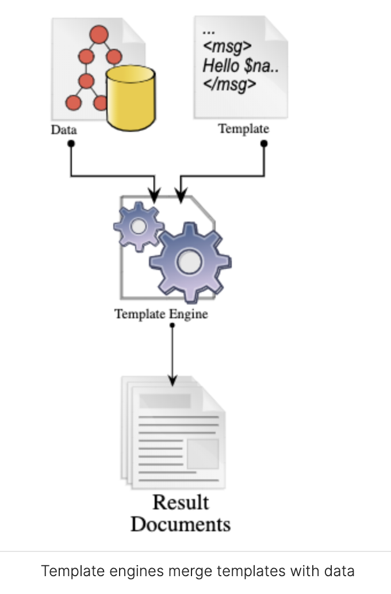

# Image Upload and Download Examples Using Spring Boot, React and AWS S3

## Dependencies/Tools Used in the Tutorial
1. Spring Boot Framework to build the backend
2. Thymeleaf Template Engine
3. AWS SDK for S3 objects handling
   1. https://aws.amazon.com/sdk-for-java/
   2. https://github.com/aws/aws-sdk-java-v2/#using-the-sdk
```aidl
<dependency>
  <groupId>software.amazon.awssdk</groupId>
  <artifactId>aws-sdk-java</artifactId>
  <version>2.21.36</version>
</dependency>
```
4. AWS Account (Free or Business)
   1. https://aws.amazon.com/
5. 

## Setup AWS Account
1. If you do not have one, than setup for AWS Free Tier account
2. If you already have one, login to AWS console

## AWS SDK for Java for Amazon S3 Development
You need to make sure that amazon cli has been setup properly on your local machine to do any sort of development with AWS services or use its AWS SDK.
1. [Setup AWS CLI](https://docs.aws.amazon.com/cli/latest/userguide/getting-started-quickstart.html)
   1. it actually creates `~/.aws/credentials` file that contains access id & secret and at times session key as well.
2. Create IAM Credentials to be used

## How to Generate AWS Access Key ID and Secret Access Key
One of the way to use AWS services programmatically is to create Amazon Web Services (AWS) credentials that allow applications to use AWS services programmatically (programmatic access). In our case this fits well as we need to use AWS S3 service API's programmatically to uploading/download files From AWS S3 buckets.

You must [sign up for an AWS account](https://www.youtube.com/watch?v=kfxhfAq8PNY) and [create an IAM admin user](https://www.youtube.com/watch?v=pPUjYD5nY_k) beforehand. You can use your AWS account root user but it is not recommended.

Follow [How to Create AWS Access Key ID and Secret Access Key](https://www.youtube.com/watch?v=yysled3Ir1o&t=2s)

## Setup Project
1. Open Project in the IDE's (IntelliJ, Visual Studio Code, Eclipse etc.)
2. Create AWS IAM AccessKeys that allows the application to access S3 and upload/download images.
   1. Go to your AWS Account -> Security Credentials

## What is MVC?
MVC is a design pattern that divides the user interface of an application into three separate components:

   1. `Model`: which contains the data to be displayed to the user.
   2. `View`: which is a visual representation of the data (e.g., HTML).
   3. `Controller`: which receives user requests and changes the state of the model.



### Useful Resources

1. https://www.interviewbit.com/blog/mvc-architecture/
2. https://www.geeksforgeeks.org/mvc-framework-introduction/

## What is Spring MVC?
The architecture of Spring MVC consists of a few cleanly separated major components with well- defined responsibilities. You can configure any of these components if you want to. You can even replace them with your own own custom implementation. This flexibility and strength was the reason it became the most popular MVC framework in Java soon after it was released.

```aidl
In order to get this, let's look at how websites work. Imagine a web app as a helpful assistant. Its main job is to handle requests and provide responses, kind of like how a business team operates. When a request for something new comes in, it goes to a coordinator who oversees the process. The coordinator starts by finding the right person for the job, someone skilled in the specific task.

For example, if it's about creating an ad, they'd ask someone who's good at coming up with ideas for ads. This person then works with others, like graphic designers or videographers, to actually create the content for the ad. Once it's all done, the coordinator hands over the final result to the person who made the request, just like delivering a finished product to a client in a business.
```
Spring MVC follows a similar workflow to serve HTTP requests as illustrated in the diagram.



As you can see, the `DispatcherServlet` is at the center of how Spring MVC functions (In some docs it may be referred as Routing mechanism that routes request to different controllers). It's just like the coordinator at the marketing company. First, it receives HTTP requests from the browser. Then it coordinates all the other major components of Spring MVC to go ahead step by step and produce a response for the browser. Let's look at each of these steps in more detail:

1. A request from a web browser is sent to our S3ImageHandling application. For example, an HTTP GET  request to the URL  /upload. This request will be received by the DispatcherServlet.
2. The DispatcherServlet asks handler mappings to see which method of which class is responsible for processing this request. A handler mapping is like a database or a person who has records of each person’s responsibility in a company. It also maps incoming requests to handler methods. A handler method is a method in a Java class that handles incoming HTTP requests. The Java class that contains these methods is called a controller class.
3. Handler mappings send back the handler method's details to the DispatcherServlet.
4. Now that DispatcherServlet knows which method is responsible for handling this request, it makes a call to that method. The HTTP request data will also be passed to the handler method as parameters.
5. The handler method (which is written by us) processes the input. For example, upload controller method takes a multipart form Input (image or pdf etc.), reads its contents, validate the input, uploads to S3 buckets, sets the Model with data returns to the dispatcher: the name of the HTML template (view), e.g.,  upload.html and the data needed to render it (model), e.g., success/fail message.
6. Dispatcher gives the view name to the view resolver to get the actual view content.
7. View resolver returns the actual HTML template content back. Note that views are also written by developers while other components are parts of the framework.
8. Dispatcher gives the model and view to the view engine (Thymeleaf template engine, for example).
9. View engine merges the view template with the data and produces plain old HTML and sends it back to DispatcherServlet.
10. Finally, DispatcherServlet sends the generated HTML back to the browser.

### What's a template engine?
Have you ever seen a wedding invitation? It’s a beautifully designed card with all the information about the couple and venue and usually somewhere at the top also has guests’ names. Well, this is templating! Someone (or a computer + printer) took the invitation letters with blank names and the list of guests and produced a stack of custom invitation letters ready to be sent. The raw invitation letter without names is the template, the list of guests is the data or model, and the person or computer who merges these two to generate the actual letters is the template engine. Another good example is creating an Welcome email template that gets send out with every new customer subscribed on youyr website where some contents remain static but some gets replaced at runtime (dynamic contents like customer name, specific welcome message etc.) 

In the context of web applications, a template engine is an engine that parses HTML pages that contain special tags or attributes bound to variables at the server (templates).  It resolves those variables into their values based on the data passed into it.  Then it parses the page according to those values and builds a normal HTML page. We will use a template engine later in this chapter to render our first page based on the data provided at the backend.



