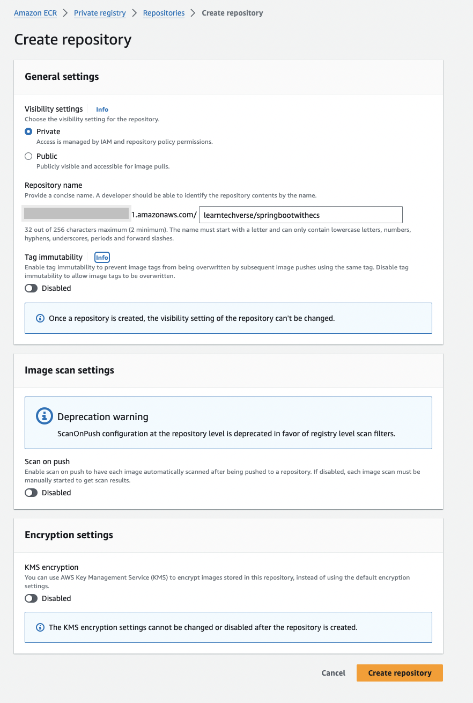
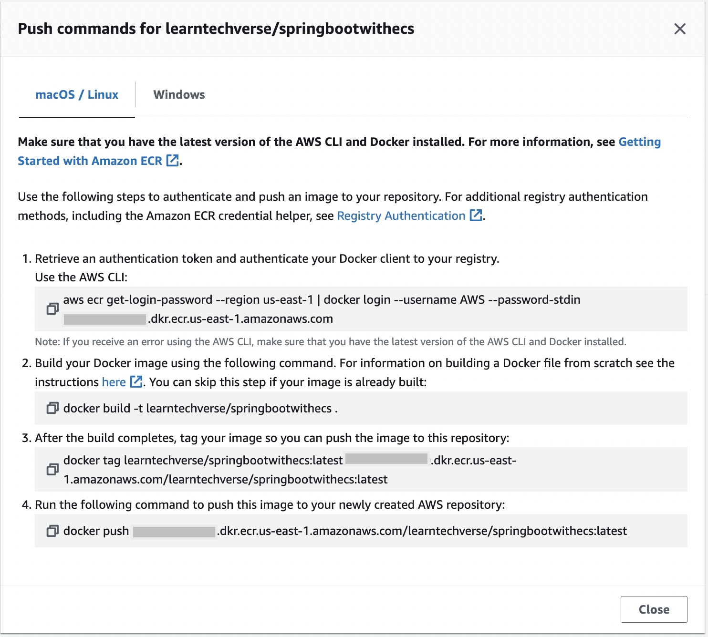
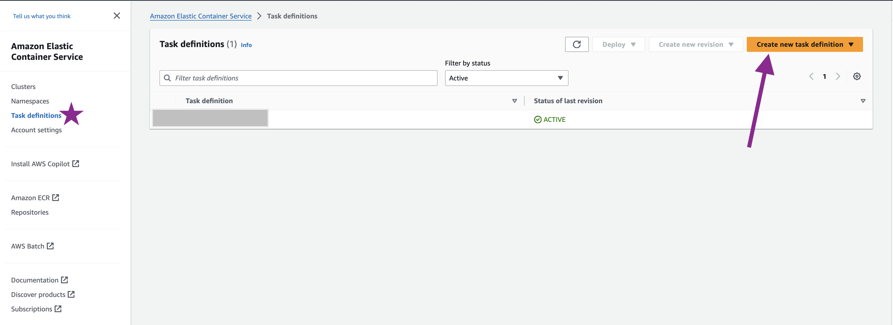
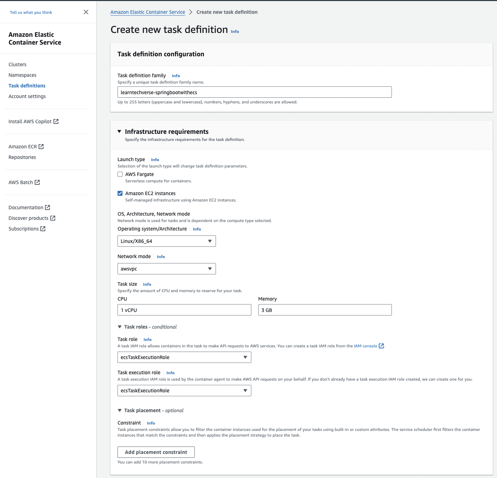
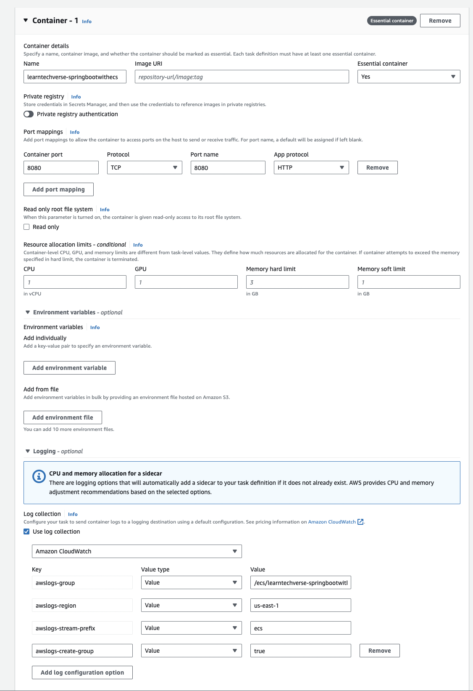
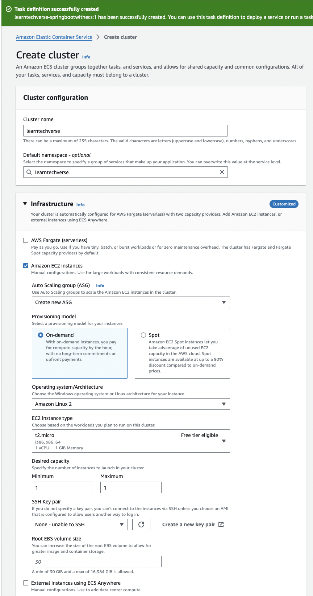
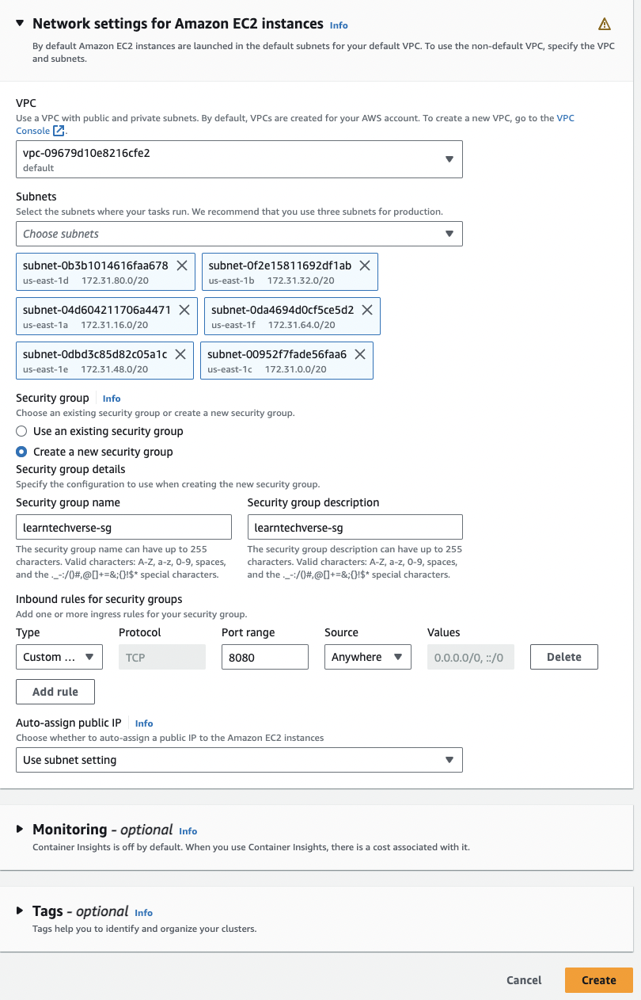
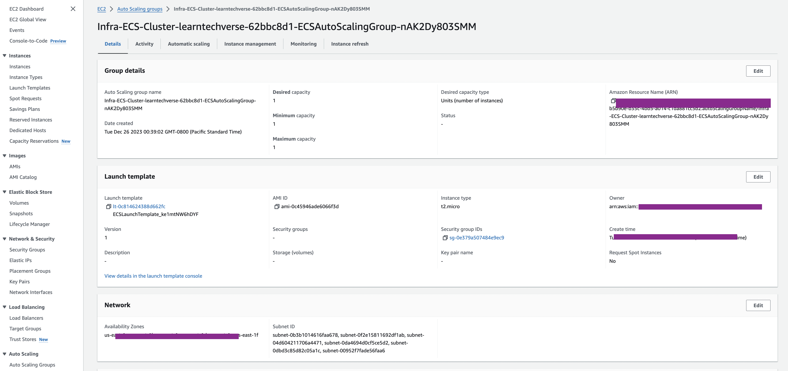
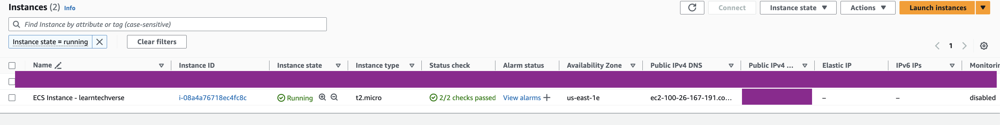
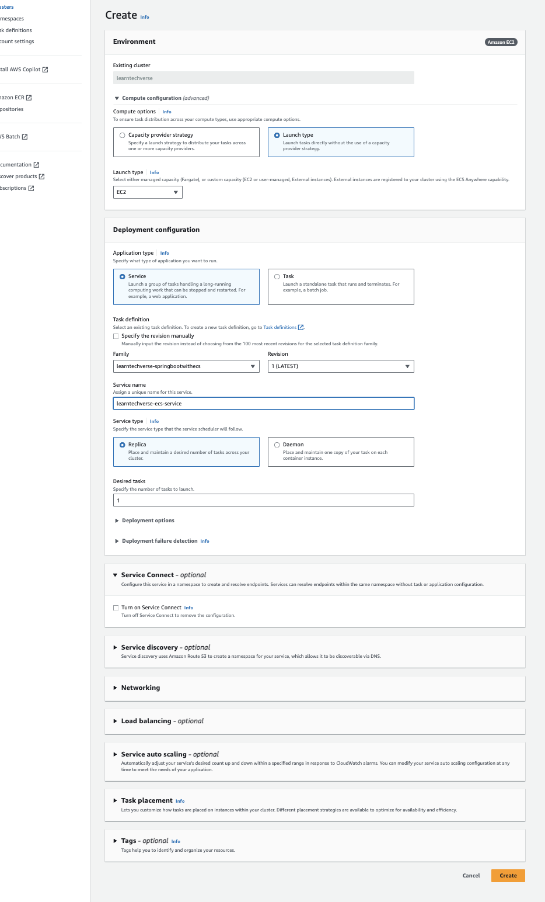

# Image Upload and Download Examples Using Spring Boot, React and AWS S3

## Dependencies/Tools Used in the Tutorial
1. Spring Boot Framework to build the backend
2. React Framework to build the SPA (Single Page Application)
3. AWS SDK for S3 objects handling
   1. https://aws.amazon.com/sdk-for-java/
   2. https://github.com/aws/aws-sdk-java-v2/#using-the-sdk
```aidl
<dependency>
  <groupId>software.amazon.awssdk</groupId>
  <artifactId>aws-sdk-java</artifactId>
  <version>2.21.36</version>
</dependency>
```
4. AWS Account (Free or Business)
   1. https://aws.amazon.com/
   2. https://repost.aws/knowledge-center/create-and-activate-aws-account
5. 

## Setup AWS Account
1. If you do not have one, than setup for AWS Free Tier account
2. If you already have one, login to AWS console

## AWS SDK for Java for Amazon S3 Development
You need to make sure that amazon cli has been setup properly on your local machine to do any sort of development with AWS services or use its AWS SDK.
1. [Setup AWS CLI](https://docs.aws.amazon.com/cli/latest/userguide/getting-started-quickstart.html)
   1. it actually creates `~/.aws/credentials` file that contains access id & secret and at times session key as well.
2. Create IAM Credentials to be used

## How to Generate AWS Access Key ID and Secret Access Key
One of the way to use AWS services programmatically is to create Amazon Web Services (AWS) credentials that allow applications to use AWS services programmatically (programmatic access). In our case this fits well as we need to use AWS S3 service API's programmatically to uploading/download files From AWS S3 buckets.

You must [sign up for an AWS account](https://www.youtube.com/watch?v=kfxhfAq8PNY) and [create an IAM admin user](https://www.youtube.com/watch?v=pPUjYD5nY_k) beforehand. You can use your AWS account root user but it is not recommended.

Follow [How to Create AWS Access Key ID and Secret Access Key](https://www.youtube.com/watch?v=yysled3Ir1o&t=2s)

## Setup Project
1. Open Project in the IDE's (IntelliJ, Visual Studio Code, Eclipse etc.)
2. Create AWS IAM AccessKeys that allows the application to access S3 and upload/download images.
   1. Go to your AWS Account -> Security Credentials

## Deploying to ECS (Elastic Container Service)
At the core of it, below are the key steps involved:-

- You will create a Docker image for your application (for example Spring Boot Application, Python App, Python Flask Web App, Node App etc.)
- We will upload the image to ECR
- We will create a Task Definition for the image
- We will create a Cluster
- We will create the service and deploy the container by means of a Service to the Cluster.
- It is highly recommended to front the application running in ECS with an Application Load Balancer.

### Enabling Application HealthChecks

#### What Is an Actuator?
In essence, **Actuator brings production-ready features to our application**.
**`Monitoring our app, gathering metrics, and understanding traffic or the state of our database becomes trivial with this dependency.`**
The main benefit of this library is that we can get production-grade tools without actually having to implement these features ourselves.
The actuator mainly exposes operational information about the running application — health, metrics, info, dump, env, etc. It uses HTTP endpoints or JMX beans to enable us to interact with it.
Once this dependency is on the classpath, several endpoints are available for us out of the box. As with most Spring modules, we can easily configure or extend it in many ways.

#### Getting Started

We need to add the spring-boot-actuator dependency to our package manager to enable the Spring Boot Actuator.

In Maven:
```
<dependency>
    <groupId>org.springframework.boot</groupId>
    <artifactId>spring-boot-starter-actuator</artifactId>
</dependency>
```
> **Note** that this remains valid regardless of the Boot version, as versions are specified in the Spring Boot Bill of Materials (BOM).

> In Spring Bppt 2.x, Actuator comes with most endpoints disabled. The only two available by default are **/health** and **/info**. If we want to enable all of them, we could set management.endpoints.web.exposure.include=*. Alternatively, we can list endpoints that should be enabled.

> All Actuator endpoints are now placed under the /actuator path by default.

> Actuator now shares the security config with the regular App security rules, dramatically simplifying the security model. So, if we are using Spring Security in our project, then we will have to tweak Actuator security rules to allow actuator endpoints. For example, We could just add an entry for /actuator/**:

```aidl

@Bean
public SecurityWebFilterChain securityWebFilterChain(
  ServerHttpSecurity http) {
    return http.authorizeExchange()
      .pathMatchers("/actuator/**").permitAll()
      .anyExchange().authenticated()
      .and().build();
}
```

#### Predefined Endpoints

Let’s have a look at some available endpoints, most of which were available in 1.x already.

Also, some endpoints have been added, some removed, and some have been restructured:

- /auditevents lists security audit-related events such as user login/logout. Also, we can filter by principal or type among other fields.
- /beans returns all available beans in our BeanFactory. Unlike /auditevents, it doesn’t support filtering.
- /conditions, formerly known as /autoconfig, builds a report of conditions around autoconfiguration.
- /configprops allows us to fetch all @ConfigurationProperties beans.
- /env returns the current environment properties. Additionally, we can retrieve single properties.
- /flyway provides details about our Flyway database migrations.
- /health summarizes the health status of our application.
- /heapdump builds and returns a heap dump from the JVM used by our application.
- /info returns general information. It might be custom data, build information or details about the latest commit.
- /liquibase behaves like /flyway but for Liquibase.
- /logfile returns ordinary application logs.
- /loggers enables us to query and modify the logging level of our application.
- /metrics details metrics of our application. This might include generic metrics as well as custom ones.
- /prometheus returns metrics like the previous one, but formatted to work with a Prometheus server.
- /scheduledtasks provides details about every scheduled task within our application.
- /sessions lists HTTP sessions, given we are using Spring Session.
- /shutdown performs a graceful shutdown of the application.
- /threaddump dumps the thread information of the underlying JVM.

#### Hypermedia for Actuator Endpoints
Spring Boot adds a discovery endpoint that returns links to all available actuator endpoints. This will facilitate discovering actuator endpoints and their corresponding URLs.
By default, this discovery endpoint is accessible through the /actuator endpoint.
Therefore, if we send a GET request to this URL, it’ll return the actuator links for the various endpoints:

```aidl
{
  "_links": {
    "self": {
      "href": "http://localhost:8080/actuator",
      "templated": false
    },
    "features-arg0": {
      "href": "http://localhost:8080/actuator/features/{arg0}",
      "templated": true
    },
    "features": {
      "href": "http://localhost:8080/actuator/features",
      "templated": false
    },
    "beans": {
      "href": "http://localhost:8080/actuator/beans",
      "templated": false
    },
    "caches-cache": {
      "href": "http://localhost:8080/actuator/caches/{cache}",
      "templated": true
    },
    // truncated
}
```

Moreover, if we configure a custom management base path, then we should use that base path as the discovery URL.

For instance, if we set the `management.endpoints.web.base-path` to `/mgmt`, we should request the `/mgmt` endpoint to see the list of links.

> Quite interestingly, when the management base path is set to /, the discovery endpoint is disabled to prevent the possibility of a clash with other mappings.

> In Spring Boot 2.0, the in-house metrics were replaced with Micrometer support,
> 
### Running in Docker
1. Build the Docker Image using command `docker build --tag=imagebuilder . `
2. Run the Container using newly created image using one of the following commands (1st one is recommended if running locally)
   - `docker run -it --name imagebuilder -p 8080:8080 -v ~/.aws/credentials:/root/.aws/credentials -d imagebuilder:latest`
   - `docker run -p8080:8080 imagebuilder:latest`
3. Check Container application logs using command `docker logs --follow imagebuilder`
4. Docker commands
   - See all the container list (Running/Stopped/Exited) using command ` docker ps --all`
   - Inspect the container using command `docker inspect imagebuilder`
   - Stop the container using command `docker stop imagebuilder`
   - Remove the container using command `docker rm imagebuilder`
   - Remove the image using command `docker rmi imagebuilder`

### Deploying Image to ECR (Amazon Elastic Container Registry)
- Go to ECR (Elastic Container registry) and create a private repo as shown below. I am giving it a name `learntechverse/springbootwithecs`

- AWS gives you list of commands you can use to push images to ECR as shown below.

  - Retrieve an authentication token and authenticate your Docker client to your registry.
    - `aws ecr get-login-password --region us-east-1 | docker login --username AWS --password-stdin [AWS-ACCOUNT-#].dkr.ecr.us-east-1.amazonaws.com`
  - Build your Docker image using the following command. For information on building a Docker file from scratch see the instructions [here](http://docs.aws.amazon.com/AmazonECS/latest/developerguide/docker-basics.html) . You can skip this step if your image is already built:
    - `docker build -t learntechverse/springbootwithecs .`
  - After the build completes, tag your image so you can push the image to this repository:
    - `docker tag learntechverse/springbootwithecs:latest [AWS-ACCOUNT-#].dkr.ecr.us-east-1.amazonaws.com/learntechverse/springbootwithecs:latest`
  - Run the following command to push this image to your newly created AWS repository:
    - `docker push [AWS-ACCOUNT-#].dkr.ecr.us-east-1.amazonaws.com/learntechverse/springbootwithecs:latest`

### Create ECS Task Definition
A versioned template of a task which you would like to run. Here you will specify the Docker image to be used, memory, CPU, etc. for your container.

Now that the Docker image is available in ECR, next thing to do is to create a Task Definition by creating the `Create new Task Definition` button in the Task Definitions section (left menu).


Following steps describe the task creation workflow.
- Step#1, Select Launch type (Self vs Fully managed)
  - Fargte - Fully Managed
  - EC2 - Self managed
- Step#2,
  - give the task definition a name
  - choose task IAM Role
    - This role is necessary for pulling the Docker image. If the role does not exist yet, select Create new role in the dropdown list. 
- Step#3, Create a container.
  - Name
  - Image URI (ECR URI)
    - This should be the Image URI of the Docker image from the ECR repository followed by the tag
  - Set the Memory Limits to 300
  - Add a Port mappings entry for host port 8080 to the container port 8080 (the Spring Boot application runs on port 8080 inside the container).



### Create ECS Cluster
The Cluster definition itself where you will specify how many instances you would like to have and how it should scale.

Follow the steps below to set up a cluster.
- Step#1, choose EC2 Linux + Networking as `cluster type`
- Step#2, Choose infrastructure `Provisioning model`, `Operating system/Architecture`, `EC2 instance type (use t2.micro specially if you have free version)`, `Desired capacity`
- Step#3, configure `Network settings for Amazon EC2 instances`
  - Choose Right VPC
  - Select all Subnets
  - Create a new Security Group to allow incoming traffic from port `8080`




After few minutes if you go to EC2 AWS service, you will see that:-
- An Auto Scaling group has been created
- An EC2 instance spun up as per the minimum desired capacity defined in the auto scaling config.



### Create ECS Service
Based on a Task Definition, you will deploy the container by means of a Service into your Cluster.

You have created a Cluster and a Task Definition. Now it is time to deploy the Task Definition containing the configuration for the Docker container into the Cluster.

Follow the steps below.
- Step#1, create the service under newly created cluster
- Step#2, Under Compute configuration (advanced) section and choose EC2 as Launch type.
- Look below the image to see other steps and config needs to be filled in (this example only looking a basic configs without ALB, Monitoring etc.)


### How to test it out
